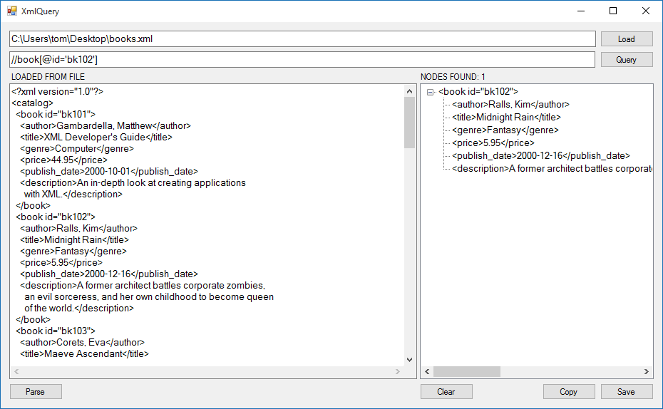

# XmlQuery

A utility for querying XML data using XPath queries.  I wrote this utility because I wanted a quick way to test XPath queries before using them in some other code I am working on.  You can load XML from a file, or you can paste it into the UI.

### Install

This is a simple .NET WinForms application written in C#.  You can just download the source and build it with Visual Studio.  I initially created the solution in Visual Studio 2010, later built it with Visual Studio 2013, and most recently with Visual Studio 2015 Community Edition.  I'm pretty sure you could build it with msbuild and not use Visual Studio at all, but I have not tested this.

### Usage

* Click the Load button to browse to an existing XML file.
* Or, paste (or type) XML into the textbox.
* Type a valid XPath query into the query textbox.
* Hit Enter or click Query to run the XPath query.
* You will see the results in the right pane.
* Use the Copy button to copy to clipboard or Save button to save to file.

